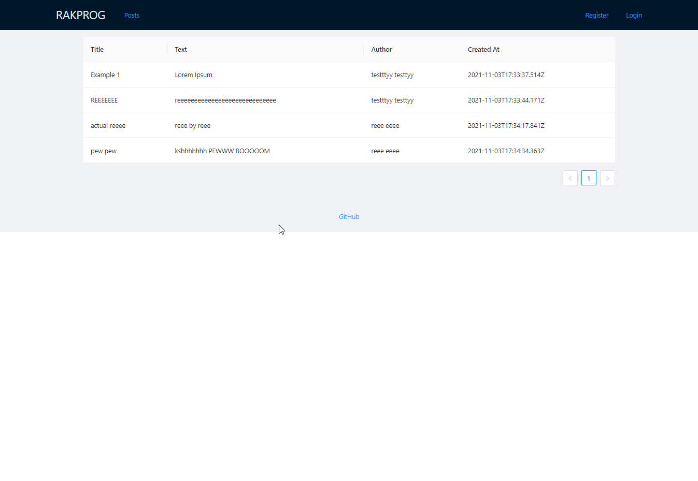

- Docker containerization
- Node.js // Express // Mongoose
- React w/ Hooks
- Login/Registration
- CRUD Posts

To Start:
```
docker-compose up -d
```

Other used commands (in local-dev):
```
docker-compose run --rm --no-deps backend_node install
docker-compose run --rm --no-deps frontend-react install
```
### Preview
